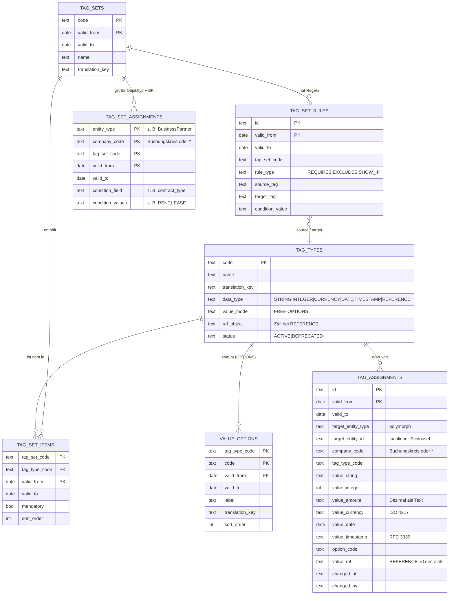

# TagManagement (`tag`)

Ein generisches Plugin, mit dem **beliebige Objekte anderer Plugins um Tags (Merkmale) erweitert
werden**, ohne dass diese Plugins eigene Spalten oder Tabellen anlegen. Beispiele sind eine
Risikoklasse, ein Kreditlimit oder das Datum der letzten Bonitätsprüfung am Geschäftspartner.

- Das Plugin `tag` (eigenes Go-Modul, nutzt nur `pkg/sdk`) beherbergt das **Modul `tagmanagement`**
  (`internal/tagmanagement`).
- **Pflege der Definitionen** (Tag-Typen, Tag Sets, Regeln, Zuordnungen) läuft über die
  gewohnte Oberfläche `/m/tagmanagement` und die JSON-API `/api/v1/tagmanagement/…`.
- **Werte an Objekten** setzt und liest man ausschließlich über den **Service `Tags`**: entweder
  aus Go über [`pkg/sdk/tagservice`](../../../pkg/sdk/tagservice/tagservice.go) oder per JSON
  über `/api/v1/tagmanagement/Tags/<action>`.
- **Kapselung:** Andere Plugins lesen nie Tabellen `tag__*`. Der Service ist der einzige Zugang.
  So kann das TagManagement später in einen eigenen Dienst wandern, ohne dass sich Aufrufer
  ändern („internal first, service ready“).
- Das Plugin braucht `databases: { main: { access: write } }` (siehe
  [`configs/07-tag.yaml`](../../../configs/07-tag.yaml)).

## Begriffe

| Begriff | Bedeutung |
|---|---|
| **Tag-Typ** (`TagType`) | Definition eines Merkmals: Code, Name, Datentyp, Wertemodus, Status |
| **Datentyp** | `STRING`, `INTEGER`, `CURRENCY` (Betrag + ISO-4217-Währung), `DATE`, `TIMESTAMP`, `REFERENCE` (Verweis auf den Schlüssel eines Datensatzes eines anderen Objects, z. B. ein Mietobjekt) |
| **Wertemodus** | `FREE` (freie Eingabe) oder `OPTIONS` (Auswahl aus `TagValueOption`) |
| **Auswahlwert** (`TagValueOption`) | erlaubter Wert eines `OPTIONS`-Tags, mit `translation_key` und Zeitscheibe |
| **Tag Set** (`TagSet`) | fachliche Gruppe von Tags (Items) mit Regeln, z. B. „Risiko“ |
| **Item** (`TagSetItem`) | ein Tag im Set: Pflicht ja/nein, Reihenfolge |
| **Regel** (`TagSetRule`) | `REQUIRES`, `EXCLUDES`, `SHOW_IF` zwischen zwei Tags des Sets |
| **Zuordnung** (`TagSetAssignment`) | Tag Set gilt für einen Objekttyp (`entity_type`) **in einem Buchungskreis** oder in allen (`*`), optional **nur für Datensätze mit bestimmten Feldwerten** (z. B. `contract_type` = `RENT`) |
| **Wert** (`TagAssignment`) | Wert eines Tags an einem konkreten Objekt (`target_entity_type` + `target_entity_id`) |

## ERD



### Tabellen

Das Präfix `tag__` gibt DBSchema vor. Die Migrationen erzeugt Atlas aus
[`schema.go`](internal/tagmanagement/schema.go); sie enthalten nie `DROP`.

| Tabelle | Object | Primärschlüssel | Lebenszyklus |
|---|---|---|---|
| `tag__tag_types` | `TagType` | `code` | Status `ACTIVE` → `DEPRECATED` (Typ B) |
| `tag__value_options` | `TagValueOption` | `tag_type_code, code, valid_from` | Zeitscheibe (Typ A) |
| `tag__tag_sets` | `TagSet` | `code, valid_from` | Zeitscheibe |
| `tag__tag_set_items` | `TagSetItem` | `tag_set_code, tag_type_code, valid_from` | Zeitscheibe |
| `tag__tag_set_rules` | `TagSetRule` | `id, valid_from` | Zeitscheibe |
| `tag__tag_set_assignments` | `TagSetAssignment` | `entity_type, company_code, tag_set_code, valid_from` | Zeitscheibe |
| `tag__tag_assignments` | nur über `Tags.*` | `id, valid_from` | Zeitscheibe |

Wie im Partner-Plugin gilt: **Das Beginndatum ist immer Teil des Primärschlüssels**, und
Fremdschlüssel zeigen nur auf Tabellen ohne Zeitscheibe (hier `tag__tag_types`). Verweise auf
Tabellen mit Zeitscheibe prüft die Engine stichtagsbezogen.

**Werte speichern:** Je Datentyp gibt es eine typisierte Spalte. Beträge stehen als Dezimaltext
in `value_amount`, damit beim Rechnen kein Gleitkommafehler entsteht. Bei `OPTIONS`-Tags steht
der Code in `option_code`. Verweise stehen als fachlicher Schlüssel (`id`) des Ziels in `value_ref`.

## Fachliche Regeln

### Tag-Typen

- `data_type` und `value_mode` sind nach dem Anlegen **unveränderlich**, denn bestehende Werte
  hängen davon ab.
- `OPTIONS` ist mit `CURRENCY` und `REFERENCE` nicht kombinierbar.
- **Lebenszyklus:** `DEPRECATED` statt Löschen. Ein veralteter Tag
  - bleibt lesbar und in der Historie,
  - nimmt aber **keine neuen oder geänderten Werte** mehr an (Verstoß `deprecated`),
  - erscheint im Editor schreibgeschützt mit dem Hinweis „veraltet“.

### Tag Sets und Regeln

- Beide Tags einer Regel müssen Items desselben Sets sein.
- Regeln je Typ:

| Regel | Bedeutung | Beispiel |
|---|---|---|
| `REQUIRES` | Ist `source` gesetzt (bzw. = `condition_value`), wird `target` **Pflicht** | `RISK = HIGH` → `AUDIT_DATE` Pflicht |
| `EXCLUDES` | Ist `source` gesetzt (bzw. = Wert), darf `target` **nicht** gesetzt sein | `PRIVATE` → kein `VAT_ID` |
| `SHOW_IF` | `target` ist **nur sichtbar**, wenn `source` (= Wert) gilt; sonst muss es leer sein | `RISK = HIGH` → `CREDIT_LIMIT` sichtbar |

Ohne `condition_value` genügt es, dass `source` überhaupt einen Wert hat. Die Regeln wertet der
Server aus (`evaluate`). Das Ergebnis ist ein `State{visible, required}` plus Verstöße
(`required`, `excludes`, `hidden`, `type`, `option`, `unknown`, `deprecated`, `reference`).

### Buchungskreis (Company Code)

Die **Zuordnung eines Tag Sets zu einem Objekttyp hängt am Buchungskreis.** So kann dasselbe
Objekt in verschiedenen Buchungskreisen verschiedene Tags haben.

- `TagSetAssignment.company_code = "*"`: Das Set gilt **global** in allen Buchungskreisen. Seine
  Werte werden einmal mit `company_code = "*"` gespeichert.
- `TagSetAssignment.company_code = "1000"`: Das Set gilt **nur in Buchungskreis 1000**. Seine
  Werte werden mit `company_code = "1000"` gespeichert, also je Buchungskreis getrennt.
- **Lesen mit `company_code = "1000"`** liefert die globalen Sets und die Sets von 1000.
  Ohne `company_code` kommen nur die globalen Sets.
- Ist dasselbe Set sowohl global als auch für 1000 zugeordnet, **gewinnt der konkrete
  Buchungskreis**. Das Item meldet seinen Geltungsbereich in `scope`.
- Buchungskreise werden gegen das IAM-Plugin (`CompanyCode`) geprüft.
- **Berechtigung beim Schreiben:**
  - Für Werte in Buchungskreis 1000 braucht man `<entity_type>.update` in 1000.
  - Für globale Werte (`*`) braucht man `<entity_type>.update` ohne Einschränkung des
    Buchungskreises.
  - Lesen setzt voraus, dass `<entity_type>.get` für das Objekt erlaubt ist.

### Bedingung: nur für Datensätze mit bestimmten Feldwerten

Objekttyp und Buchungskreis reichen nicht immer. Ein Mietvertrag braucht andere Tags als ein
Versicherungs- oder Darlehensvertrag, obwohl alle drei `Contract` sind. Deshalb kann eine
Zuordnung zusätzlich ein **Feld des Objects** und **einen oder mehrere Werte** nennen:

| entity_type | company_code | tag_set_code | condition_field | condition_values |
|---|---|---|---|---|
| `Contract` | `*` | `RENT_SET` | `contract_type` | `RENT` |
| `Contract` | `*` | `LOAN_SET` | `contract_type` | `LOAN,INSURANCE` |
| `Contract` | `*` | `GENERAL` | – | – |

- Die Werte sind ODER-verknüpft. Eingabe kommagetrennt (auch `;` oder zeilenweise), gespeichert
  normalisiert ohne Leerzeichen und Dubletten.
- **Prüfung beim Anlegen** gegen das Metamodell des Objekttyps (Catalog): Das Feld muss
  existieren. Bei Auswahlfeldern (`select`) müssen die Werte gültige Optionen sein, bei
  Ja/Nein-Feldern `true` oder `false`.
- **Auswertung:** `Tags.get`, `set`, `validate` und `schema` mit `entity_id` lesen den Datensatz
  über `<entity_type>.get` und vergleichen den Feldwert als Text. Maßgeblich ist der Datensatz,
  den `get` liefert, also die heute gültige Zeitscheibe.
- `Tags.schema` **ohne** Datensatz:
  - mit `attributes` (z. B. `{"contract_type": "RENT"}`, etwa für eine Neuanlage) → gefiltert,
  - ohne `attributes` → alle Sets; die Bedingung steht in `TagSet.condition`.
- Ändert sich der Feldwert (Vertragsart wechselt), erscheinen die Tags des anderen Sets. Werte des
  alten Sets bleiben gespeichert und in `Tags.history` sichtbar, sie sind nur nicht mehr
  zugewiesen.

### Verweis-Tags (`REFERENCE`)

Ein Tag vom Datentyp `REFERENCE` verweist auf einen Datensatz eines **anderen Objects**, zum
Beispiel `RENTAL_OBJECT` → `RentalObject` am Mietvertrag oder `PARENT` → `BusinessPartner`
(Konzernmutter).

- `ref_object` ist Pflicht, unveränderlich und muss ein Object mit Metamodell sein. Auswahlwerte
  (`OPTIONS`) gibt es für Verweise nicht.
- Der Wert ist der **fachliche Schlüssel** (`id`) des Ziels, nicht der Zeitscheiben-Schlüssel
  `_id`, und überlebt damit neue Zeitscheiben des Ziels.
- `Tags.set`/`validate` prüfen über `<ref_object>.get`, dass das Ziel existiert und lesbar ist
  (Verstoß `reference`).
- `Tags.get` liefert zusätzlich `ref_label`, das `TitleField` des Ziels laut Metamodell (ohne
  Leserecht: die id).
- `Tags.find` mit `{"ref": "<id>"}` beantwortet die Umkehrfrage, etwa: Welche Verträge verweisen
  auf dieses Mietobjekt?

### Zeitscheiben und Stichtag

- Alle Lese-Actions nehmen `effective_date` (Standard: heute). Das gilt für die Definitionen und
  die Werte: Ein Tag Set, ein Item, eine Regel oder ein Auswahlwert wirkt nur innerhalb seiner
  Gültigkeit.
- `Tags.set` schreibt **ab `valid_from`** (Standard: heute):
  1. Es beendet die laufende Zeitscheibe zum Vortag.
  2. Es legt eine neue Zeitscheibe an.
  3. Es löscht nie physisch.
  4. Ein Wert `null` beendet das Tag zum Vortag.
  5. Nicht genannte Tags bleiben unverändert (Merge-Semantik).
- Gibt es zu einem Tag schon eine **künftige** Zeitscheibe ab einem späteren Datum, lehnt der
  Service ab, statt die Zukunft zu überschreiben: „… hat ab … bereits eine künftige
  Zeitscheibe“.
- `changed_at` und `changed_by` protokollieren jede Zeitscheibe. `Tags.history` liefert die
  vollständige Historie.

### Umschlüsselung

Ändert ein Modul den Schlüssel eines Datensatzes, meldet es das SystemEvent `<Object>.rekey`
(`old_id`, `new_id`), z. B. `BusinessPartner.rekey` bei der Übernahme auf BP-Nummern. Das
Tag-Plugin abonniert `*.rekey` und stellt Zuordnungen (`id` bzw. `id|Zeitscheibe`) und
Verweis-Tags auf dieses Object um.

## TagService-API

Go-Vertrag: [`pkg/sdk/tagservice`](../../../pkg/sdk/tagservice/tagservice.go). Ein anderes
Modul nutzt ihn per Dependency Injection:

```go
tags := tagservice.New(env.Services)

et, err := tags.Get(ctx, tagservice.GetRequest{
    EntityType: "BusinessPartner", EntityID: bpID, CompanyCode: "1000",
    EffectiveDate: "2026-10-06", Locale: "de",
})

_, err = tags.Set(ctx, tagservice.SetRequest{
    EntityType: "BusinessPartner", EntityID: bpID, CompanyCode: "1000", ValidFrom: "2026-11-01",
    Values: map[string]*tagservice.Value{
        "RISK":         tagservice.Option("HIGH"),
        "AUDIT_DATE":   tagservice.Date("2026-10-07"),
        "CREDIT_LIMIT": tagservice.Money("50000.00", "CHF"),
        "OLD_TAG":      nil, // beenden
    },
})
```

| Methode / Action | Zweck | Payload (JSON) | Antwort |
|---|---|---|---|
| `Schema` / `Tags.schema` | Welche Sets, Tags und Regeln gelten für den Objekttyp | `entity_type, entity_id?` oder `attributes?`, `company_code?, effective_date?, locale?` | `Schema{sets[{code, name, company_code, items[{tag, mandatory, scope}], rules}]}` |
| `Get` / `Tags.get` | Werte eines Objekts am Stichtag samt Regelzustand | dazu `entity_id` | `EntityTags{…Schema, entity_id, values[], state}` |
| `Set` / `Tags.set` | Werte setzen oder beenden ab `valid_from` (atomar, alles oder nichts) | `entity_type, entity_id, company_code?, valid_from?, values{TAG: Value \| null}` | `EntityTags` nach dem Schreiben, bei Verstößen `InvalidArgument` |
| `Validate` / `Tags.validate` | wie `set`, schreibt aber nicht (Vorschau, Formularprüfung) | wie `set` | `{violations[], state}` |
| `History` / `Tags.history` | alle Zeitscheiben eines Objekts, optional nur ein Tag | `entity_type, entity_id, company_code?, tag?` | `{values: Assignment[]}` |
| `Find` / `Tags.find` | Objekte mit Tag (und Wert) am Stichtag | `entity_type, tag, value?, company_code?, effective_date?` | `{entity_ids[]}` |

`Value` ist eine Union. Genau das Feld zum Datentyp wird gesetzt:

```json
{"string": "…"} · {"integer": 42} · {"amount": "1500.00", "currency": "EUR"}
{"date": "2026-10-07"} · {"timestamp": "2026-10-07T08:00:00Z"} · {"option": "HIGH"} · {"ref": "9834…"}
```

Der Service prüft:

- den Datentyp,
- das Betragsformat (bis 4 Nachkommastellen),
- die ISO-4217-Währung,
- die Gültigkeit von Auswahlwerten am Stichtag,
- Pflicht und Regeln.

`locale` steuert Namen und Labels über `translation_key` (de, en, zh-CN). Fehlt eine
Übersetzung, gilt der gepflegte Name.

**Polymorphie:** `entity_type` ist der Object-Name des besitzenden Plugins, zum Beispiel
`BusinessPartner`. `entity_id` ist dessen fachlicher Schlüssel `id`, nicht der
Zeitscheiben-Schlüssel `_id`. Damit überleben Tags neue Zeitscheiben des Objekts. Vor jedem
Zugriff ruft der Service `<entity_type>.get` auf. Das prüft, ob das Objekt existiert und ob
der Aufrufer es lesen darf.

### Beispiel per JSON-API

```bash
curl -b jar -H 'Content-Type: application/json' \
  -d '{"entity_type":"BusinessPartner","entity_id":"9834…","company_code":"1000",
       "values":{"RISK":{"option":"HIGH"}}}' \
  http://localhost:8080/api/v1/tagmanagement/Tags/validate
# → {"payload":{"violations":[{"tag":"AUDIT_DATE","code":"required",
#      "message":"Letzte Bonitätsprüfung (AUDIT_DATE) ist Pflicht"}], "state":{…}}}
```

`GET /api/v1/tagmanagement` (Modulbeschreibung) listet `Tags` unter den Services, mit den
Actions, die der Benutzer ausführen darf.

## UI: `<TagEditor entityType entityId>`

Der WebServer stellt den TagEditor generisch bereit. Ein Fachmodul bindet ihn ein, indem es
in der Detailansicht seines Objekts einen Abschnitt mit `Tags: true` deklariert:

```go
{Key: "merkmale", Title: "Merkmale", Tags: true} // metamodel.SectionDefinition
```

Mehr ist nicht nötig, weder Code noch Template im Fachmodul. Ein Tag Set für den Objekttyp
zuordnen genügt, dann erscheinen die Felder.

**Ablauf:**

1. Der Abschnitt lädt per htmx lazy `GET /tags/{entityType}/{id}`. Das ist der
   „`<TagEditor entityType entityId>`“.
2. **Kopfzeile:** Stichtag (`effectiveDate`) und Buchungskreis-Auswahl (`companyCode`, aus
   IAM; „Alle Buchungskreise (global)“ zeigt nur globale Sets). Ein Wechsel lädt den Editor neu.
3. **Je Tag Set ein Fieldset**, je Item ein Feld passend zum Datentyp:
   - `OPTIONS` → Auswahl (übersetzte Labels)
   - `REFERENCE` → Schlüssel des Ziels + Auswahldialog (`/lookup?object=<ref_object>`), daneben der lesbare Text und das Kopfdaten-Symbol ⓘ
   - `CURRENCY` → Betrag + Währung
   - `DATE` / `TIMESTAMP` → Datums- bzw. Datum-Zeit-Feld
   - `INTEGER` → Zahl
   - `STRING` → Text
4. **Kennzeichen am Feld:**
   - `*` = Pflicht (mandatory oder REQUIRES)
   - „seit …“ = Beginn der aktuellen Zeitscheibe
   - „BK 1000“ = nur in diesem Buchungskreis
   - „veraltet“ = DEPRECATED, schreibgeschützt
5. **Live-Regeln:** Jede Änderung schickt das Formular an `POST /tags/{…}/preview`. Das ruft
   `Tags.validate` auf. Der Server rendert den Editor mit dem neuen `state` zurück: SHOW_IF
   blendet Felder ein oder aus, REQUIRES setzt `*`. Die Regeln leben also nur im Server, nicht
   doppelt in JavaScript.
6. **Speichern** mit „Gültig ab“ → `POST /tags/{…}` → `Tags.set`.
   - Ausgeblendete Felder werden als `null` gesendet und damit beendet.
   - Veraltete Tags werden nicht gesendet.
   - Ein Komma im Betrag wird zum Punkt, Währungen werden großgeschrieben.
   - Verstöße erscheinen am Feld und oben im Editor. Es wird nichts geschrieben.
7. **Berechtigungen:** Ohne `Tags.set` oder `<entity>.update` ist der Editor schreibgeschützt
   und ohne Speichern-Knopf. Ist das TagManagement nicht installiert, zeigt der Abschnitt einen
   Hinweis statt eines Fehlers.

Formularnamen: `effectiveDate`, `companyCode`, `validFrom`, `v.<TAG>`, bei Beträgen
`v.<TAG>.amount` und `v.<TAG>.currency`.

## Aufbau

| Datei | Inhalt |
|---|---|
| `internal/tagmanagement/module.go` | Modul `tagmanagement`: Definitions-Objects + Service `Tags` |
| `internal/tagmanagement/schema.go` | Tabellen (Atlas HCL) |
| `internal/tagmanagement/entities.go` | Definitions-Objects auf Basis von [`pkg/sdk/crud`](../../../pkg/sdk/crud) |
| `internal/tagmanagement/values.go` | Datentypen, Betrag, ISO 4217 |
| `internal/tagmanagement/service.go` | Schema am Stichtag, Regeln, Schreiben mit Zeitscheiben, Historie, Suche |
| `internal/tagmanagement/i18n/*.json` | Übersetzungen de, en, zh-CN |

Die generische CRUD- und Zeitscheiben-Engine `pkg/sdk/crud` stammt aus dem Partner-Plugin und
wird jetzt von `partner` und `tag` geteilt.

## Bauen und testen

```bash
make build   # baut u. a. bin/plugins/ta/tag-0.2.0-<os>-<arch>
make test    # inkl. cd cmd/plugins/tag && go test ./...
```

Die Tests (`tagmanagement_test.go`, `condition_ref_test.go`) laufen gegen SQLite mit echten Atlas-Migrationen. Sie
decken ab:

- Datentypen und Währungen,
- Auswahlwerte mit Zeitscheibe,
- alle drei Regeltypen,
- Buchungskreis-Scope und -Berechtigung,
- Zeitscheiben inkl. künftiger Scheiben,
- DEPRECATED-Tags,
- Bedingungen auf Feldwerte (Mietvertrag vs. Darlehensvertrag),
- Verweis-Tags inkl. Label und Suche,
- `find` und `history`.
